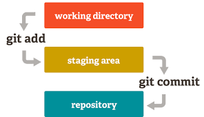

# Git instrucion manual.  

## Version Control Introduction

1. Create a new directory on your computer to hold your project. 

2. Go to the new directory with the Visual Studio Code. 
*File - Open Folder.*

3. Open the Terminal in VSCode. 
*Terminal - New Terminal*

4. The following commands will help the program to remember you and to mark all the changes with your name and E-mail.

> **git config --global user.name «Your name in English»**

> **git config --global user.email e-mail@example.com**

5. Print **git init** to initialize an empty Git, basically *.git* directory for the objects.

6. Create a document with the name GitInstruction.md in the Folder.
***File extension is required.***

7. The **git add** command will add your new (or changed) file in your working directory to the Git staging area.

>> The **Tab** key after **git add** will run through the file names to find the necessary one.

>> The **git commit -m "brief comment"** command will save all the staged changes, along with the brief description from the user, in a "commit" to the local repository.
Without **git add**, no **git commit** command would ever do anything!

>> There can be several **git add** commands and the one **git commit -m "Comment"** command after that.

>> Use **git commit —amend -m «another version of the comment»** to edit the last comment and save the commit.

8. Try the **git status** command. It will show the tracked, untracked files and changes.

>> This command will not show any commit records or information. Mostly, it is used to display the state between **git Add** and **git commit** command.

9. The **git log** command displays all of the commits in a repository's history.

10. The **git checkout first_symbols_of_the_file's_name** command is used to switch between commits.

>> **Git checkout master** switches you to the current branch "master" to the specific actual state.

11. **git diff** is used to track the difference between the last commit and the changes made in a file. 

12. **git add** * will add all the modified and new (untracked) files in the current directory preparing them for the **git commit**.

13. Use up and down arrows ⬆️⬇️ to choose one of the commands that was typed before.

14. Don't forget to use **Ctrl + S** buttons to save all the changes in file before **git add** command. 

>> The white point ⏺ after the file name remind you about it.

15. **git --version** command is to check the current version of Git. 

16. If you stuck somehow after git **log** command, type **q** to exit.

17. When you rename file in working directory of a repository manually, specify for Git that the file was not delete, it was renamed: use **git add** command for the previous name and the same for the actual one, preparing file for **git commit** stage. 

18. **clear** is a computer operating system command which can be used in terminal to bring the command line on top of the computer terminal. 

### Images
1. Save a picture to the folder with repository .git.
2.  

***
 
### Git File Statuses

* ***U*** - untracked

* ***A*** - added

* ***M*** - modified

***
Download and install Git <https://git-scm.com/book/ru/v2/%D0%92%D0%B2%D0%B5%D0%B4%D0%B5%D0%BD%D0%B8%D0%B5-%D0%A3%D1%81%D1%82%D0%B0%D0%BD%D0%BE%D0%B2%D0%BA%D0%B0-Git>

Download and install VSC <https://code.visualstudio.com/>

***
***
***

## Git Ignore Status 

### One can choose to ignore a file instead of saving it.

Add a ***.gitignore*** file in the folder with repository.

Print the following commands:

- ***git add .gitignore***
- ***git commit -m*** "Created .gitignore File"
- Print the file's name in **.gitignore** file.
- Use ***Ctrl+S*** command to save the change.
- ***git add .gitignore***
- ***git commit -m*** "Added the necessary file name to ignore"

! All the file names printed in **.gitignore** are ignored by Git.

## Branching and Merging

***git branch*** - displays the whole list of branches.

***git branch branch_name_to_create*** - creates a new branch with the name.

***git checkout branch_name_to_come*** - is to switch the branch.

***git merge branch_name_to_merge*** - combines all the integrated changes into a single branch.

***git branch -d branch_name_to_delete*** - is used to delete an unnecessary branch.

***git log --graph*** - creates a graphic overview of the logs and of how various pipelines have branched and merged over time.

## More of the Version Control
